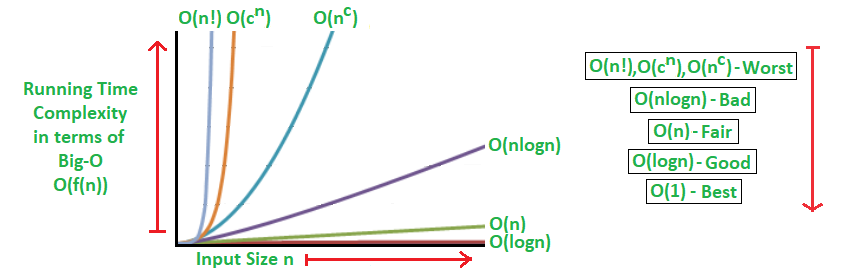

# Katas

## Categories

### Arrays

* [Tournament Winner](./arrays/tournament-winner)
* [Two Number Sum](./arrays/two-number-sum)
* [Validate Subsequence](./arrays/validate-subsequence)
* [Sorted Squared Array](./arrays/sorted-squared-array)

### Strings

* [Ceasars Cipher](./strings/ceasars-cipher)
* [Run-Length Encoding](./strings/run-length-encoding)

### Dynamic Programming

* [Number of Ways to Make Change](./dynamic-programming/number-of-ways-to-make-change)
* [Max Subset Sum No Adjacent](./dynamic-programming/max-subset-sum-no-adjacent)
* [Min Number of Coins for Change](./dynamic-programming/min-number-of-coins-for-change)

### Graphs

* [Single Cycle Check](./graphs/single-cycle-check)

### Heaps

* [Min Heap Construction](./heaps/min-heap-construction)

### Greedy Algorithms

* [Min Waiting Time](./greedy-algorithms/min-waiting-time)
* [Class Photos](./greedy-algorithms/class-photos)

### Algorithms

* [Kadence](./algorithms/kadane)

### Binary Search Trees

* [Find Closest Value in BST](./bst/find-closest)

### Binary Trees

* [Branch Sums](./binary-trees/branch-sums)
* [Node Depths](./binary-trees/node-depths)

### Recursion

* [Product Sum](./recursion/product-sum)

### Search

* [Find Three Largest Numbers](./search/find-three-largest)

### Linked Lists

* [Remove Duplicates from List](./linked-lists/remove-duplicates-from-list)

## Complexity Analysis

Complexity Analysis is the process fo determining how efficient an algorithm is. Complexity analysis usually involves finding both the **time complexity** and the **space complexity** of an alogorithm.

Complexity analyis is effectively used to determine how 'good' an algorithm is and wheather its 'better' than another one.

**Time Complexity**

A measure of how fast an algorithm runs, time complexity is a central concept in the field of algorithms and in coding interviews.

**Space Complexity**

A measure of how much auxilliary memory an algorithm takes up, space complexity is a central concept in the field of algorithms and in coding interviews.

## Big O Notation

The speed and memory usage of an algorithm aren't necessarily fixed; they might change depending on the input. So how do we express the performance of an algorithm then?

Enter *Big O Notation*, a powerful tool that allows us to generalize the space-time complexity of an algorithm as a function of its input size. So it is the notation used to describe the **time complexity** and **space complexity** of algorithms.

Variables used in Big O notation denote the sizes of inputs to algorithms. For
example, **O(n)** might be the time complexity of an algorithm that
traverses through an array of length **n**; similarly,
**O(n + m)** might be the time complexity of an algorithm that traverses
through an array of length **n** and through a string of length **m**.

The following are examples of common complexities and their Big O notations, ordered from fastest to slowest:

* **Constant**: O(1)
* **Logarithmic**: O(log(n))
* **Linear**: O(n)
* **Log-linear**: O(nlog(n))
* **Quadratic**: O(n<sup>2</sup>)
* **Cubic**: O(n<sup>3</sup>)
* **Exponential**: O(2<sup>n</sup>)
* **Factorial**: O(n!)

Note that in the context of coding interviews, Big O notation is usually
understood to describe the
**worst-case** complexity of an algorithm, even though the worst-case
complexity might differ from the **average-case** complexity.

For example, some sorting algorithms have different time complexities
depending on the layout of elements in their input array. In rare cases, their
time complexity will be much worse than in more common cases. Similarly, an
algorithm that takes in a string and performs special operations on uppercase
characters might have a different time complexity when run on an input string
of only uppercase characters vs. on an input string with just a few uppercase
characters.

Thus, when describing the time complexity of an algorithm, it can sometimes be
helpful to specify whether the time complexity refers to the average case or
to the worst case (e.g., "this algorithm runs in O(nlog(n)) time on average
and in O(n<sup>2</sup>) time in the worse case").

**Example**

Consider an array, `a` of length `N` and three functions `f1`, `f2` and `f3` as shown below. The S|T complexity is noted next to each function. Note the `pair` function takes each element in the array and outputs that element with every other element in the array - essentially pairing them all up.

```
a = [. . .] (size: N)

f1(a) => 1 + a[0]   runs in O(1)  'constant time'
f2(a) => sum(a)     runs in O(N)  'linear time'
f3(a) => pair(a)    runs in O(n**2) 'quadratic time'
```

**Big O Notation Graph**

For more infomation on Big O Notation check out [this article]().

</img>